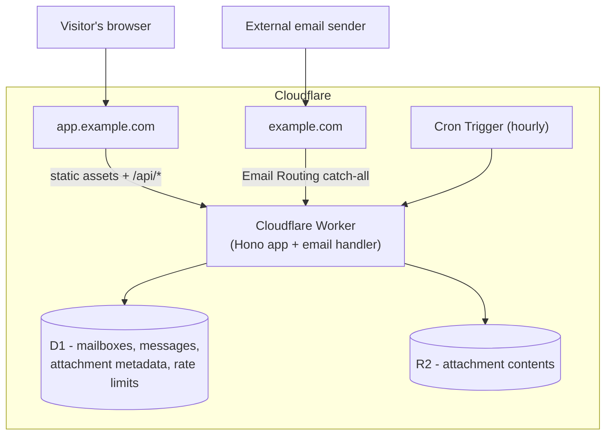

# TempMail

A temporary, disposable email service built entirely on Cloudflare: **Workers**,
**D1**, **R2**, **Email Routing**, and **Cron Triggers**. No account, no
password, no external APIs — mailboxes generate a human-looking address
locally, receive real email through Cloudflare's own mail infrastructure, and
delete themselves automatically after a configurable TTL.

```
emiliano.zieme.1439@example.com
kshlerin.antonina.9290@example.com
thauck.2250@example.com
```

## Contents

- [Overview](#overview)
- [Features](#features)
- [Architecture](#architecture)
- [Requirements](#requirements)
- [Project structure](#project-structure)
- [Cloudflare setup](#cloudflare-setup)
- [Environment variables](#environment-variables)
- [Development](#development)
- [Testing](#testing)
- [API reference](#api-reference)
- [Security](#security)
- [Production deployment](#production-deployment)
- [Known limitations](#known-limitations)

## Overview

TempMail gives a visitor a disposable email address the moment they load the
page — no signup, no personal information. Mail sent to that address is
parsed, stored, and shown in a simple inbox in the same browser tab. The
mailbox and everything in it is deleted automatically after 48 hours (or
immediately, if the visitor asks for a new one), and access to a mailbox's
contents is always gated by a separate secret token — never by knowledge of
the address alone.

The whole system — the web app, the API, and the code that parses incoming
mail — runs as one Cloudflare Worker. There is no separate backend server,
no VM, no container, and no external name-generation or mailbox API.

## Features

- **Faker-style address generation**, entirely local — no network calls, no
  third-party name API. Hundreds of first names and surnames are bundled in
  the Worker, combined via five different patterns (`first.last.####`,
  `last.first.####`, `first##.####`, `last.####`, `first.last####`) so
  addresses don't look mechanically generated.
- **Custom addresses** with live availability checking.
- **Real email receiving** via Cloudflare Email Routing — plain text, HTML,
  multipart, and attachments, parsed with `postal-mime`.
- **Attachments** stored in R2 under unpredictable keys, never served
  publicly — only through an authenticated Worker endpoint.
- **Security-first HTML rendering**: incoming HTML email is rendered in a
  fully sandboxed `<iframe sandbox="">` with its own strict CSP. No
  `allow-scripts`, no `allow-same-origin`. Remote images are blocked by
  default (only inline `data:` images load) to avoid tracking pixels, with
  an explicit "Load images" opt-in.
- **No account, ever.** A mailbox is a random ID plus a separate, high-entropy
  access token — the token is Web-Crypto-generated, stored only as a SHA-256
  hash, and never derived from or interchangeable with the email address.
- **Automatic + immediate cleanup**: an hourly Cron Trigger sweeps expired
  mailboxes in bounded batches; deleting a mailbox (or a single message) is
  instant and cascades through D1 and R2.
- **No countdown timer.** The 48-hour TTL is enforced server-side and is
  never surfaced as a ticking clock in the UI.
- Dark / light / system theme, mobile-first responsive layout, keyboard and
  screen-reader accessible.

## Architecture



One Worker, two triggers into it (HTTP requests and incoming email), two
storage bindings (D1 for structured data, R2 for attachment bytes), and one
Cron Trigger for cleanup. Static frontend files (`public/`) are served by
Cloudflare's Workers Static Assets directly from the edge; anything under
`/api/*` reaches the Worker's `fetch` handler.

## Requirements

- A Cloudflare account with a domain you control (for Email Routing) — or
  just Workers access for local development/testing without real mail.
- [Node.js](https://nodejs.org/) 18+
- [Wrangler](https://developers.cloudflare.com/workers/wrangler/) (installed
  as a dev dependency; invoked via `npx wrangler`)

## Project structure

```
src/
├── index.ts                 # Worker entry: Hono app, fetch/scheduled/email handlers
├── routes/                  # mailbox.ts, message.ts, attachment.ts, health.ts
├── email/                   # handler.ts (Email Routing entry), parser.ts (postal-mime wrapper)
├── lib/                     # username-generator, token, validation, rate-limit, security, ...
├── db/                      # D1 data-access: mailboxes.ts, messages.ts
├── cleanup/                 # expired-mailboxes.ts (Cron job)
└── types/                   # shared Env + DTO types

data/
├── first-names.ts           # ~490 bundled first names
└── surnames.ts              # ~540 bundled surnames

migrations/                  # D1 schema migrations
tests/                       # vitest-pool-workers test suite (114 tests)
public/                      # static frontend: index.html, app.js, styles.css
.github/workflows/ci.yml     # test on every push/PR; deploy on main after tests pass
```

## Cloudflare setup

These steps assume a fresh Cloudflare account. Run them once per environment
(development/staging/production).

### 1. Install dependencies and log in

```bash
npm install
npx wrangler login
```

### 2. Create the D1 database

```bash
npx wrangler d1 create tempmail-db
```

Copy the `database_id` from the output into `wrangler.toml`:

```toml
[[d1_databases]]
binding = "DB"
database_name = "tempmail-db"
database_id = "PASTE_YOUR_ID_HERE"
```

Apply the schema:

```bash
npx wrangler d1 migrations apply tempmail-db --local   # for local dev
npx wrangler d1 migrations apply tempmail-db --remote  # for the deployed Worker
```

### 3. Create the R2 bucket

```bash
npx wrangler r2 bucket create tempmail-attachments
```

The binding in `wrangler.toml` (`ATTACHMENTS`) already points at this bucket
name — no ID to copy for R2.

### 4. Configure Email Routing

Email Routing is configured at the zone level in the Cloudflare dashboard,
not in `wrangler.toml`:

1. In the Cloudflare dashboard, select the domain you want mail to arrive at
   (e.g. `example.com`) and open **Email** → **Email Routing**.
2. Enable Email Routing. Cloudflare will add the necessary MX and SPF DNS
   records automatically.
3. Under **Routing rules**, add a **Catch-all address** rule with the action
   **Send to a Worker**, and select this Worker (deploy it first — step 6 —
   so it appears in the list).
4. Do **not** add an HTTP redirect or proxy rule on the mail domain that
   would interfere with mail delivery — MX records aren't affected by proxy
   status, but avoid pointing the domain's `A`/`CNAME` at something that
   fights with Email Routing's own DNS records.

If `app.example.com` (the web app) and `example.com` (mail) are different
hostnames — the recommended split — the web app's DNS/routes are configured
separately in **Workers & Pages → your Worker → Triggers → Routes/Custom
Domains**.

### 5. Configure the Cron Trigger

Already declared in `wrangler.toml`:

```toml
[triggers]
crons = ["0 * * * *"]  # hourly
```

No dashboard step needed — this activates automatically on deploy.

### 6. Set environment variables and deploy

Edit the `[vars]` block in `wrangler.toml` (`EMAIL_DOMAIN`, `APP_URL`, TTL,
and size limits — see [Environment variables](#environment-variables)), then:

```bash
npx wrangler deploy
```

Re-run step 4 once the Worker exists so it's selectable as an Email Routing
destination.

## Environment variables

All configuration lives in `wrangler.toml`'s `[vars]` block (or per-environment
`[env.<name>.vars]`). None of these are secrets — no API keys or credentials
are configured this way; D1/R2 access is via bindings, and there is nothing
else to authenticate to.

| Variable                      | Purpose                                             | Default    |
| ------------------------------ | ---------------------------------------------------- | ---------- |
| `EMAIL_DOMAIN`                 | Domain new addresses are generated under             | `example.com` |
| `APP_URL`                      | Public URL of the web app (informational/CORS-free)  | `https://app.example.com` |
| `MAILBOX_TTL_HOURS`            | Mailbox lifetime before automatic cleanup            | `48`       |
| `MAX_MESSAGE_SIZE`             | Max accepted raw message size, bytes                 | `10485760` (10 MiB) |
| `MAX_ATTACHMENT_SIZE`          | Max accepted size per attachment, bytes              | `5242880` (5 MiB) |
| `MAX_ATTACHMENTS_PER_MESSAGE`  | Attachments kept per message; extras are dropped     | `10`       |
| `MAX_MESSAGES_PER_MAILBOX`     | Mailbox capacity; further mail is bounced (SMTP reject) | `200`   |
| `CLEANUP_BATCH_SIZE`           | Mailboxes processed per Cron invocation              | `50`       |

For local development against `localhost`, the defaults work as-is — mail
delivery obviously requires a real domain with Email Routing configured, but
the mailbox/API/frontend flow works fully without it.

## Development

```bash
npm install
npm run dev          # wrangler dev - local Worker + simulated D1/R2
npm run typecheck    # tsc --noEmit
npm run lint         # eslint
npm test             # vitest, via @cloudflare/vitest-pool-workers
npm run build        # type-check build gate (wrangler itself bundles at deploy time)
```

`npm run dev` serves the frontend from `public/` and the API from the same
origin, matching production. Without a configured Email Routing rule, you can
still exercise the whole mailbox/API/UI flow locally; simulating incoming
mail without a real Email Routing rule is what the test suite's `email()`
handler tests are for (see below).

## Testing

The test suite runs against the **actual Workers runtime** (`workerd`) via
`@cloudflare/vitest-pool-workers` — not a Node.js approximation — with real
D1 and R2 bindings simulated locally. 114 tests across 10 files:

- **`username-generator.test.ts`** — thousands of generated usernames checked
  for valid syntax, dataset membership, length bounds, reserved-name
  exclusion, and pattern-distribution sanity, plus collision-retry behavior.
- **`validation.test.ts`**, **`token.test.ts`**, **`attachment-validation.test.ts`**,
  **`html-sanitize.test.ts`** — focused unit tests for each security-relevant
  primitive (normalization, confusable-Unicode rejection, constant-time token
  comparison, filename sanitization, HTML stripping).
- **`email-parser.test.ts`** — MIME parsing against hand-built multipart
  messages (plain text, HTML, attachments, missing headers, malformed input).
- **`mailbox.test.ts`**, **`email-handler.test.ts`** — full HTTP-level and
  `email()`-handler-level integration tests: mailbox creation/auth/deletion,
  end-to-end mail delivery into a mailbox and back out through the API,
  cross-mailbox isolation, oversized-message and full-mailbox rejection.
- **`security.test.ts`** — rate limits actually tripped (not just configured),
  expired-token/expired-mailbox handling, enumeration-resistance (identical
  error responses for "no such mailbox" vs. "wrong token"), and end-to-end
  XSS/path-traversal payloads run through the real pipeline.
- **`cleanup.test.ts`** — the Cron job's expired-vs-active mailbox handling,
  D1+R2 cascade deletion, bounded batching across multiple runs, and
  idempotency.

```bash
npm test
```

## API reference

All endpoints are same-origin JSON, prefixed `/api`. Responses are always
`{ "success": true, "data": ... }` or `{ "success": false, "error": { "code", "message" } }`.
Mailbox-scoped endpoints require `X-Mailbox-Id: <id>` and
`Authorization: Bearer <token>` headers — the token is returned exactly once,
at creation time.

| Method | Path                          | Auth | Description |
| ------ | ----------------------------- | ---- | ----------- |
| POST   | `/api/mailbox`                | —    | Create a mailbox. Body `{}` for an auto-generated address, or `{ "localPart": "name" }` for a custom one. |
| GET    | `/api/mailbox`                | ✓    | Fetch the authenticated mailbox's own info. |
| GET    | `/api/mailbox/check`          | —    | `?localPart=name` — availability check (rate-limited). |
| DELETE | `/api/mailbox`                | ✓    | Immediately delete the mailbox and everything in it. |
| GET    | `/api/mailbox/messages`       | ✓    | List messages, newest first. `?limit=&offset=`. |
| GET    | `/api/mailbox/messages/:id`   | ✓    | Full message detail, including attachment metadata. |
| DELETE | `/api/mailbox/messages/:id`   | ✓    | Delete a single message and its attachments. |
| GET    | `/api/attachments/:id`        | ✓    | Download an attachment (streamed from R2). |
| GET    | `/api/health`                 | —    | `{ "status": "ok" }` — no infrastructure details exposed. |

## Security

Summarized here; see inline comments in `src/lib/security.ts`,
`src/lib/auth.ts`, `src/email/handler.ts`, and `public/app.js` for the
specifics.

- **Mailbox access tokens**, not addresses, are the credential: 256 bits of
  `crypto.getRandomValues` entropy, SHA-256-hashed at rest, compared in
  constant time.
- **Untrusted HTML email** is rendered in a `sandbox=""` iframe (no
  `allow-scripts`, `allow-same-origin`, `allow-forms`, or `allow-popups`)
  with its own strict CSP, plus a defense-in-depth textual sanitizer applied
  before storage. The sandbox — not the sanitizer — is the actual security
  boundary.
- **Attachments**: random R2 keys (`attachments/{mailboxId}/{messageId}/{randomId}`,
  never the original filename), filenames sanitized against path traversal
  and null bytes, served only through an authenticated endpoint that forces
  `Content-Disposition: attachment` for HTML/SVG/XML content types.
- **D1's `UNIQUE(address)` constraint is authoritative** for mailbox
  uniqueness — creation is insert-and-handle-conflict, never
  check-then-insert, so concurrent requests can't race into a duplicate.
- **Rate limiting** (D1-backed fixed windows) on mailbox creation,
  availability checks, deletion, message listing, and attachment downloads.
- **Enumeration resistance**: a nonexistent mailbox ID and a wrong token for
  a real mailbox return byte-identical error responses.
- **No open relay**: this Worker only ever receives mail; there is no code
  path that sends or forwards email anywhere.
- **Privacy**: no accounts, no phone numbers, no analytics. Logs are
  structured (route, status, mailbox ID, error code) and never include
  tokens, full message bodies, or attachment contents.

## Production deployment

`.github/workflows/ci.yml` runs type-checking, linting, and the full test
suite on every push and pull request. A second job deploys to Cloudflare via
`wrangler deploy` — but only after the test job succeeds, and only on pushes
to `main`. It needs two GitHub Actions secrets:

- `CLOUDFLARE_API_TOKEN` — a scoped token with Workers Scripts, D1, and R2
  edit permissions for your account.
- `CLOUDFLARE_ACCOUNT_ID`

Neither is ever printed to logs; GitHub Actions also automatically redacts
secret values that happen to appear in step output.

To deploy manually instead:

```bash
npx wrangler d1 migrations apply tempmail-db --remote
npx wrangler deploy
```

## Known limitations

- This project was built and verified with the full `vitest-pool-workers`
  test suite (114 tests, running against the real `workerd` runtime with
  simulated D1/R2) and static analysis of the frontend (HTML validation,
  JS syntax checks, manual ID/class cross-referencing). It has **not** been
  exercised against a live Cloudflare account, a real domain's Email
  Routing, or an actual browser — the `wrangler`/dashboard steps above are
  correct as documented, but you are the first to run this end-to-end for
  real. Budget time for first-deploy troubleshooting.
- The bundled name dataset (~490 first names, ~540 surnames) is
  intentionally curated rather than exhaustive; extend `data/first-names.ts`
  / `data/surnames.ts` if you want more variety at scale.
